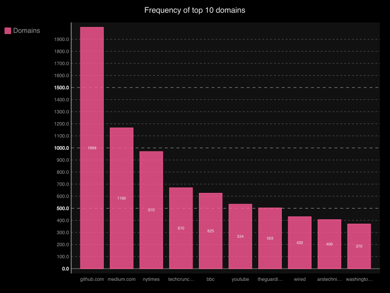

Hacker News Top
==============

[](https://travis-ci.org/rylans/hackernews-top)

Unofficial Python wrapper over Hacker News' official Firebase API.

### Install

```
> git clone https://github.com/rylans/hackernews-top.git
> cd hackernews-top
> pip install .
```

### Roadmap

* Item types:
  * Story **Partial support**
  * Comment
  * Job
  * Ask HN
  * Poll
* User **Partial support**
* API calls
  * ~~`v0/item`~~ **Done**
  * ~~`v0/user`~~ **Done**
  * ~~`v0/topstories`~~ **Done**
  * `v0/maxitem` **Partial support**
  * `v0/updates`
* Schema assertions

### Statistical Data



### License

Apache
